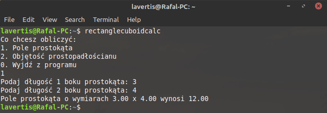

# RectangleCuboidCalc
C console program which calculates area of a rectangle and volume of a cuboid.

Version: 1.3

## Installation:
Download [rectanglecuboidcalc-1.3.tar.gz](https://github.com/Lavertis/RectangleCuboidCalc/raw/master/rectanglecuboidcalc-1.3.tar.gz).

`tar zxvf rectanglecuboidcalc-1.3.tar.gz`

`cd rectanglecuboidcalc-1.3`

`./configure`

`make`

`sudo make install`

## Usage:
`rectanglecuboidcalc`

## Overview:

